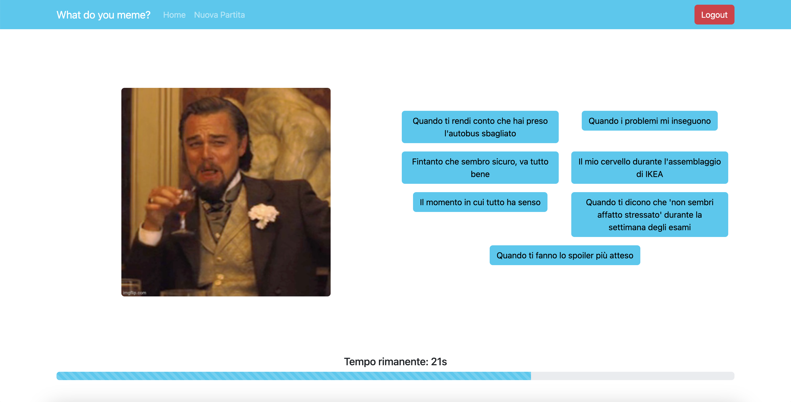
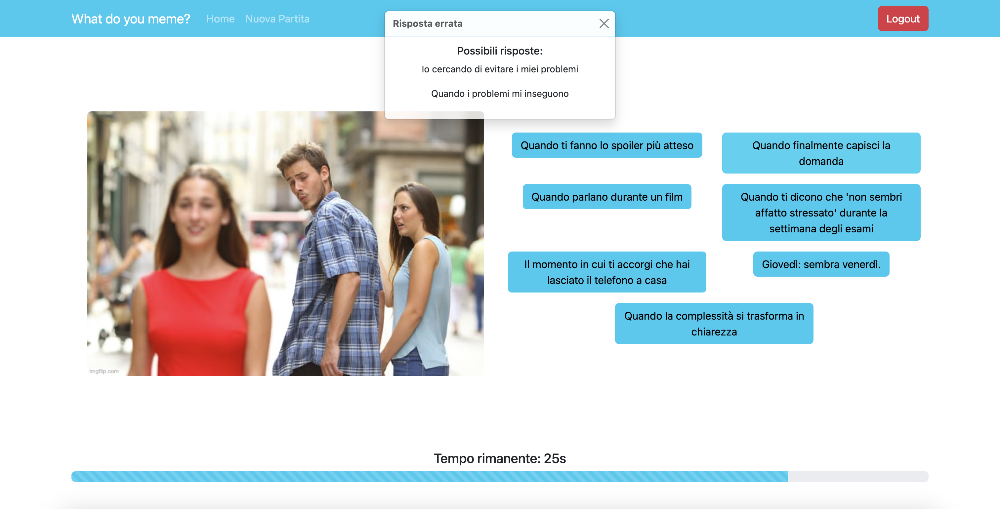

# Exam #1: "Gioco dei Meme"
## Student: s332167 BERGAMINI LUCA 

## React Client Application Routes

- Route `/`: This page is the home page. There're the **Login** and the **Ospite** buttons, to decide in which way we want to play. Logged-in users see two other buttons to see their old matches (statistiche) or for play a new match;

- Route `/play`: The purpose of this page is to display the actual game of memes. We can see 3 rounds (with different memes) for the logged-in users. At the end of the game, a summary of the game will be shown. 

- Route `/users/:username`: This page shows user infos and old matches of a logged-in user. There is a summary for each round of each match, each summary reports the meme and the points scored by the user;

- Route `/matches/guest`: The purpose of this page is to display the actual game of memes. We can see 1 round for the not logged-in users. At the end of the game, a text visualizing the score of the round will be shown;

- Route `/login`: Represent the login page where the user can log in. Username and password are required in this form.

## API Server

### API User

#### POST `/api/users/sessions`

Allows login for a user with the provided credentials.

  - Access constraints: `None`
  - Request Parameters: `None`
  - Request Body Content: 
    - `username`: required string
    - `password`: required string
  - Response Body content: 
    - Status `201`: user correctly logged in, ex: `{id: 1, username: user1, name: test1, surname: test1}`
    - Status `401`: credentials are invalid, ex: `{message: "Incorrect username or password."}`

#### DELETE `/api/users/session/current`

Performs logout for the currently logged in user. 

  - Access constraints: User must be logged in
  - Request Parameters: `None`
  - Request Body Content: `None`
  - Response Body content: `None`

### API Meme

#### GET `/api/memes`

Retrieves memes and captions for the match (three memes-captions for the logged in user or one meme-captios for the guest user).

  - Access constraints: `None`
  - Request Parameters: `None`
  - Request Body Content: `None`
  - Response Body content:
    - An array of an object, ex `[{ meme: {id: 1, url: "https://example.com/meme1.jpg"}, captions: [{id: 1, text: "Caption1"}, {id:2, text: "Caption2"}]}]`
    - Status `500`: if an error occurs while getting the memes, ex: `{message: "Internal server error"}`

#### POST `/api/memes/caption`

Retrieves the two correct captions for the meme (passed in the body). 

  - Access constraints: `None`
  - Request Parameters: `None`
  - Request Body Content:
    - `memeId`: required numeric. Representing the meme for which is needed the correct caption
  - Response Body content:
    - An array of `Caption`, ex: `[{id: 1, text: "Caption1"}, {id: 2, text: "Caption2"}]`
    - Status `500`: if an error occurs while getting the memes, ex: `{message: "Internal server error"}`

### API Match

#### GET `/api/matches/<userId>`

Retrieves the user's matches and rounds.

  - Access constraints: User must be logged in
  - Request Parameters:
    - `userId`: required numeric. Representing the logged-in user, by his id
    Example: `/api/matches/1`
  - Request Body Content: `None`
  - Response Body content: 
    - An array of an object, ex: `[{matchId: 1, date: "2024-06-18", totalScore: 10, [{matchId: 1, memeUrl: 1, captionText: 1, score: 5}, {matchId: 1, memeUrl: 2, captionText: 6, score: 0}, {matchId: 1, memeUrl: 3, captionText: 5, score: 5}]}]`
    - Status `500`: if an error occurs while getting the memes, ex: `{message: "Internal server error"}`

#### POST `/api/matches/<userId>/match`

Create a new match with the provided informations.

  - Access constraints: User must be logged in
  - Request Parameters:
    - `userId`: required numeric. Representing the logged-in user, by his id
    Example: `/api/matches/1/match`
  - Request Body Content:
    - `date`: required date with format `YYYY-MM-DD`. It's the date when the match was played
    - `totalScore`: required numeric. Representing the total score, obtained adding all scores of all rounds
    - `rounds`: required array. Representing all the rounds of a match
  - Response Body content: 
    - The `id` of the created match in the database, ex: `{id: 1}`
    - Status `503`: if an error occurs while getting the memes, ex: `{error: "Impossible to add the match"}`

## Database Tables

- Table `users` - contains id (primary key), username (unique), name, surname, password and salt (all the user's infos);

- Table `memes` - contains id (primary key), url (unique);

- Table `captions` - contains id (primary key), text (unique);

- Table `captionMatchesMeme` - contains memeId, captionId (togheter primary key);

- Table `matchHistories` - contains id (primary key), userId, date, totalScore (used to save all the user's matches);

-Table `rounds` - contains id (primary key), matchId, memeId, captionId, score (for saving all the rounds for each match).

## Main React Components

- `LoginForm` (in `AuthComponent.jsx`): allows the user to log in with his credentials (username and password);

- `GameComponent` (in `GameComponent.jsx`): this component is a card used to display a match and his round(s) with the total score, meme image and the selected caption;

- `GamePage` (in `GamePage.jsx`): this is the game page, composed by `PopUpComponent`, `MemeComponent` and `TimerComponent` (in `GamePage.jsx`, used to display the timer for the round(s));

- `PopUpComponent` (in `PopUpComponent.jsx`): this is the component used to show to the user whether the selection made is correct or not, in this case the two correct captions are shown;

- `MemeComponent` (in `MemeComponent.jsx`): this is the component used to show a meme and the possile captions that the user can select for the meme;

- `GameResultPage` (in `GameResultPage.jsx`): the purpose of this component is to show the results of the played rounds;

- `PresentationPage` (in `PresentationPage.jsx`): this component is the first page viewed by the user. In this page the user can choose to login or to play as guest, then the logged-in user can select to play or have a look about his statistics;

- `ProfilePage` (in `ProfilePage.jsx`): this page is used to have a look about the user informations and about all the matches (and their rounds) played by the user.

## Screenshot

### Game Page

### Game Page with popup

## Users Credentials

- **username:** user1, **password:** test (have some played match)
- **username:** user2, **password:** test (have not played any match)
